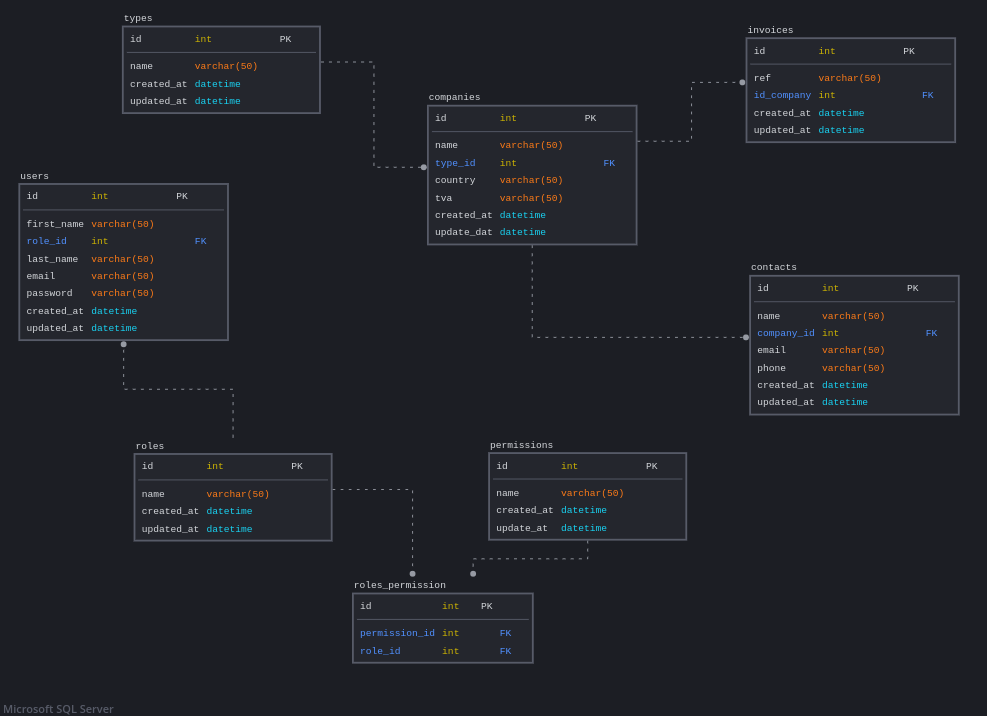
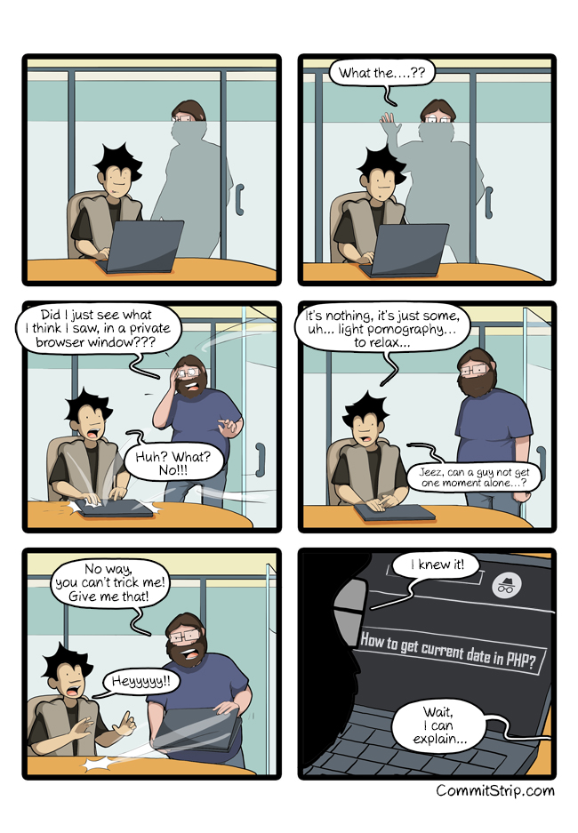

# Copig Project

- **Type of challenge:** consolidation
- **Repository:** Cogip_Project
- **Duration:** 10 days
- **Deadline:** To complete
- **Team Challenge:** 4,5 people

## Groups

- Team 1:

  - Backend (NodeJs): Caroline, Jordan
  - Frontend: Dylan, Jean-Emmanuel

- Team 2:

  - Backend (NodeJs): Nathanaël, Arnaud
  - Frontend: Zahra, Tom

- Team 3:

  - Backend (PHP): Dzheylyan, Giovanni, Isabelle
  - Frontend: Maryam, Lyne

- Team 4:

  - Backend (PHP): Illess, Adrien C, Ludovic
  - Frontend: Nataliia, Stacy, Julie

- Team 5:

  - Backend (PHP): Justine, Adrien B., Youris

## Mission

The COGIP is a company which we don't know a lot about apart that they produce Jean-Michel toys and that they are serious workers check. They also have incredible employees within their rank.

Jean-Christian Ranu works in accounting at the COGIP. He has been using an old, ugly and incomplete software for years, making him go between it and excels sheet. Jean-Christian like paella, crosswords and his coworker Muriel Perrache.

Your mission here is to code a web application which will respond to the needs and desire of Jean-Christian.

NOTE: Don't forget to add an SQL file containing the structure in the repository, as well as, an entry within the README detailing what each person did.

## Where to start?

- For the whole team, please clone this [basic project](base/) (not mandatory), it will help you to start the project (Transform the basic project into an API).

## Languages Used & Mission(s)

### Back-end

#### Languages OR technologies Used

- PHP
- POO
- MVC
- Namespace
- bramus router (A lightweight and simple object oriented PHP Router) or your own router
- filp/whoops: (PHP errors for cool kids)

#### Missons

As backend developpers, your mission is to create an API relating to this mission.

- Install all the dependances using composer
- Confirm PHP (POO) and MVC Structure
- CRUD
- Validation & Sanitization (controllers)

### Front-end

#### Languages OR technologies Used

- React (mandatory) using vite
- SASS or a CSS framework

#### Missions

- Respect the following [mockup](https://www.figma.com/file/PS5hPdhywkRfxreITOYwba/Cogip?node-id=0%3A1)
- Mobile First
- Validation Client Side
- Using npm (tailwind or your preferences)
- Google Ligthouse Test
- Semantics

## Database (including Relationships)

Here are the tables you need to structure the projet

## Pages (front side)

### Welcome Page

The welcome page should display:

- A welcome message for Jean-Christian Ranu (if logged in)
- The list of the last 5 invoices, ordered by date
- The list of the last 5 people encoded in the database
- The list of the last 5 companies encoded in the database
- A link to the providers page
- A link to the client page

### Companies Page

This page will display a list of all companies in alphabetical order. The name of the company will be a link to a new page detailing the company, the content will be generated with the ID of the chosen company.

### Invoices Page

This page will display a list of all the invoices from the most recent to the oldest. Each invoice number will be a link to a new page detailing the invoice, the content will be generated with the ID of the chosen invoice.

### Contacts page

This page will display a list of all the contacts in alphabetical order. Each contact name will be a link to a new page detailing the contact, the content will be generated with the ID of the chosen contact.

## Pages (Admin side)

Once you have done the consultation part of the accounting database for Jean-Christian, you will have to create an interface of administration from which he'll be able to input, modify and delete data. (CRUD)

He will need a dashboard in which he will have a direct access to the:

- Five last invoices (number invoice, date, company), by clicking the invoice number or the company, he will be able to edit them.
- Five last companies (company name, its type), by clicking the invoice the company name, he will be able to edit them.
- Five last contact (first and last name, email, company name), by clicking the contact name, the invoice number or the company name, he will be able to edit them.

On the same line as each element there should also be an bin icon to delete it.

With the help of button there should also be quick access to:

- New invoice
- New contact
- New company

There must also be a custom message on the welcome page depending if Muriel or Jean-christian is connected.

## Bonus (1)

### Auth

If you have so much time left, you can create an auth system for your application (Of course, you an use a package if you want.)

### Roles & permissions

- If the user as god mode access (by default: Jean-Christian as it, his password is his last name) he will also have access to a button to manage the users. This button will lead him to a dashboard showing the members (users who have an access to the application), their access right and the power to modify them.

- If the user as moderator access (by default: Muriel, her password is her last name) he will have access to the admin dashboard, he can add invoices, companies and people but can't either modify or delete elements from the database.

In your database, you can add a role (admin or moderator) and allow some features/pages/functionalities depending on the role.

## Bonus (2) Hardcore

### Roles & permissions

As the current database schema, you can observe there are two tables (roles and permissions). It means that each role, you can assign many permissions, which is more configurable.

Be carrefull, if you want to take this way, please use middleware in your routes ;)

## Ressources

- [flip/whoops](https://github.com/filp/whoops)
- [bramus/router](https://github.com/bramus/router)
- [PHP FIG](https://www.php-fig.org/)

